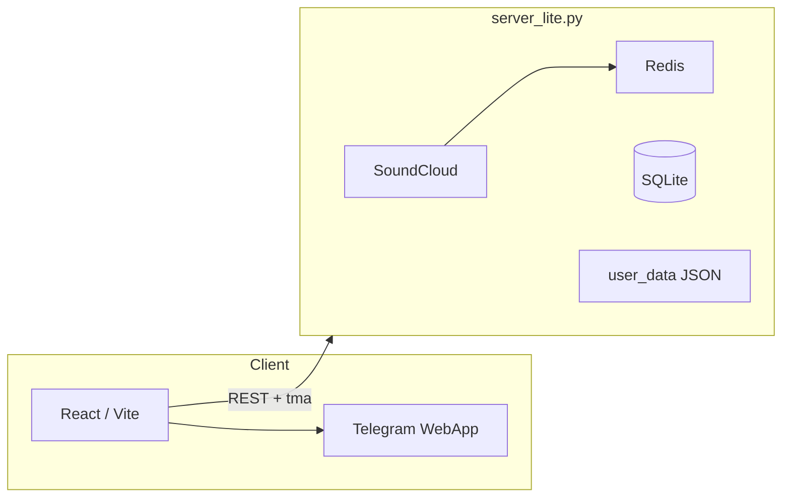

# TGPlay · Telegram Mini App & PWA

Music search, playlists, background playback, sharing to chat and Stories.

| | |
|---|---|
| **Production** | **[tgplay.fun](https://tgplay.fun)** |
| **Bot** | [@tgplayxbot](https://t.me/tgplayxbot) |

Open-source snapshot of the production codebase. Secrets and deploy config are **not** in this repo — see `backend/.env.example`.

---

## Stack

| Layer | Tech |
|-------|------|
| **Client** | React 18, TypeScript, Vite, Tailwind, HLS.js |
| **API** | Python 3, FastAPI, asyncio |
| **Data** | SQLite (analytics), JSON playlists, Redis (search/metadata cache) |
| **Integrations** | Telegram Bot API & WebApp, SoundCloud; legacy VK/YouTube for old track IDs |
| **Quality** | ESLint, Vitest, pytest |

## API

OpenAPI / Swagger: `http://localhost:8000/docs` (after local backend start).

Admin: `src/components/AdminStatsApp.tsx`, routes under `/api/admin/` in `server_lite.py`. Analytics: `backend/analytics_db.py`.

## Production highlights

- Single FastAPI process serves API + static `dist/` (PWA)
- Auth: Mini App `Authorization: tma …`; web OAuth/PKCE + session JWT
- Rate limits per Telegram user / IP; hashed asset caching (`immutable` for Vite bundles)
- Async-safe analytics (SQLite init once per process; no sync hot-path on webhooks)
- Deep links `tr_*` / `pl_*`; story cards `GET /api/story-card/{token}.jpg`

## Features

- Search & ranking (SoundCloud; artist–title normalization)
- Playlists: favorites, custom, deep links
- Player: queue, shuffle, repeat, Media Session, skip broken tracks
- Recommendations & «Моя волна»
- Share: 9:16 JPEG for Stories, send to chat via Bot API

## Architecture



Details: [docs/ARCHITECTURE.md](docs/ARCHITECTURE.md)

## Key files

| Path | Purpose |
|------|---------|
| [`src/App.tsx`](src/App.tsx) | Views, player, search, recommendations, deep links |
| [`src/lib/api.ts`](src/lib/api.ts) | HTTP client, `tma` / Bearer auth |
| [`src/components/FullPlayer.tsx`](src/components/FullPlayer.tsx) | Full-screen player |
| [`backend/server_lite.py`](backend/server_lite.py) | API, webhook, static, resolve, playlists |
| [`backend/sc_client_simple.py`](backend/sc_client_simple.py) | SoundCloud OAuth & search |
| [`backend/analytics_db.py`](backend/analytics_db.py) | Events, dislikes, aggregates |

## Local run

```bash
git clone https://github.com/dirtyworker666x/tgplay-telegram-music-miniapp.git
cd tgplay-telegram-music-miniapp

cp backend/.env.example backend/.env
# BOT_TOKEN, SOUNDCLOUD_CLIENT_ID/SECRET, WEBAPP_URL

npm ci
pip install -r backend/requirements.txt

npm run dev                 # http://localhost:5173
python3 backend/server_lite.py   # http://localhost:8000 · API docs http://localhost:8000/docs
```

Full UX in production: **[tgplay.fun](https://tgplay.fun)**. Telegram Login on `localhost` needs OAuth secrets on the server.

## Tests

```bash
npm test && npm run lint
cd backend && python -m pytest tests/ -q
```

## Layout

```
├── src/                    # React client
├── backend/
│   ├── server_lite.py
│   ├── sc_client_simple.py
│   ├── analytics_db.py
│   └── tests/
├── docs/ARCHITECTURE.md
└── public/
```

## License

MIT — [LICENSE](LICENSE)
